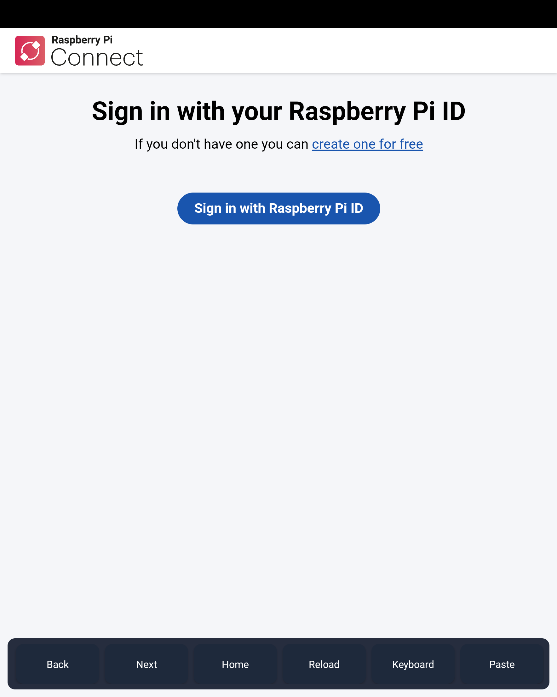
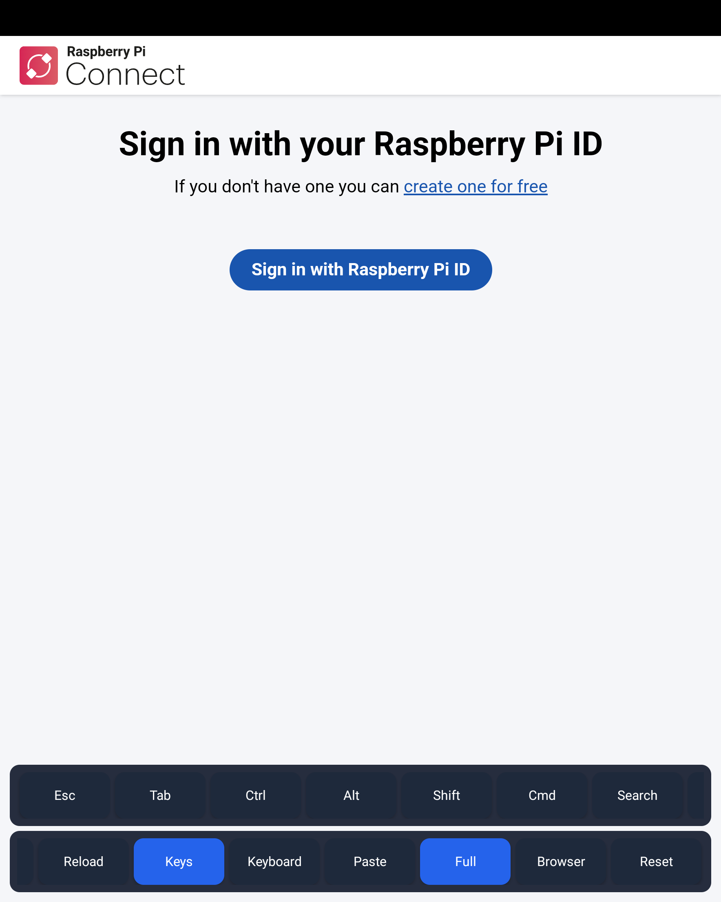
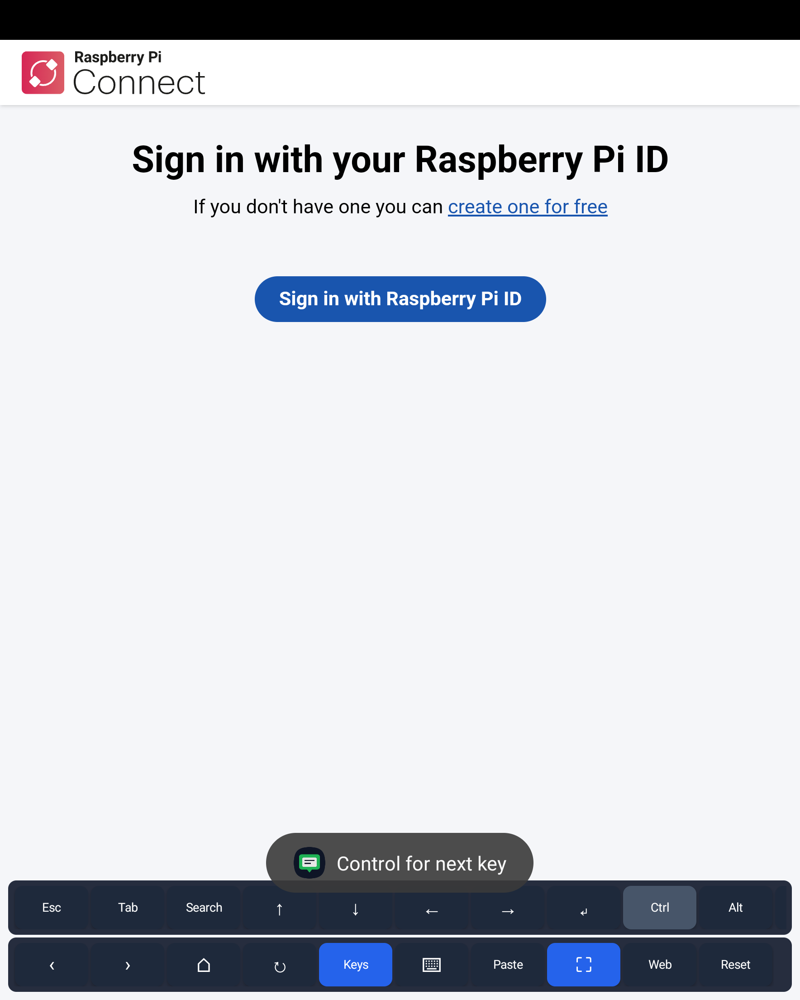
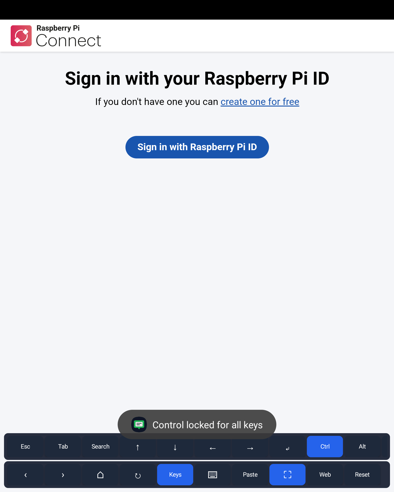

# Pi Connect Android

An experimental Android companion for [Raspberry Pi Connect](https://connect.raspberrypi.com/), focused on making the browser-based remote access experience easier to use from a phone or tablet.

The app keeps the official Connect web experience in a fullscreen WebView and adds native Android controls around the parts that are awkward on a touchscreen: navigation, paste, fullscreen, Android keyboard access, and remote-friendly shortcut keys.

> Raspberry Pi is a trademark of Raspberry Pi Ltd. This project is independent and is not affiliated with, sponsored by, or endorsed by Raspberry Pi Ltd.

## License

This project is source-available under the [PolyForm Noncommercial License 1.0.0](LICENSE). Personal, hobby, research, educational, and other noncommercial use is permitted. Commercial use, including publishing a derivative app, selling builds, bundling it into a paid product, or using it for a commercial service, requires prior written permission from the copyright holder.

The software is provided as-is, without warranty or liability, as described in the license.

This is not an OSI-approved open source license because commercial use is restricted. See [COMMERCIAL.md](COMMERCIAL.md), [CONTRIBUTING.md](CONTRIBUTING.md), and [NOTICE](NOTICE) before reusing or contributing.

## Screenshots

| Sign-in and toolbar | Remote key bar |
| --- | --- |
|  |  |

| Sticky modifier | Locked modifier |
| --- | --- |
|  |  |

## Features

- Fullscreen WebView for Raspberry Pi Connect.
- Persistent cookies and DOM storage for sign-in.
- WebRTC permission bridge for trusted Raspberry Pi domains.
- Bottom controls for back, forward, home, reload, Android keyboard, remote key bar, and fullscreen.
- Browser fallback, clipboard paste, offline-aware retry, and web session reset controls.
- Remote key bar for Escape, Tab, sticky/locked modifiers, terminal shortcuts, arrows, paging, and Enter.
- Compact icon-style controls with long-press help for full key/action descriptions.
- GitHub Actions debug APK build, so the Raspberry Pi does not need Android Studio or the Android SDK.

## Why this exists

Raspberry Pi Connect already works in a browser, but mobile browsers are not always comfortable for remote desktop and shell work. This project tries to keep the setup simple while adding the native controls that make short maintenance tasks more practical from Android:

- reach a Pi quickly from a phone,
- send common terminal and desktop keys without a hardware keyboard,
- recover from session issues with reload/reset controls,
- keep the remote screen usable in fullscreen landscape or portrait.

## Roadmap

- Trackpad-style mouse mode with right click, drag lock, and scroll gestures.
- Configurable shortcut rows for terminal, desktop, browser, editor, and shell workflows.
- Tablet layout improvements for wider screens and landscape sessions.
- Better onboarding that explains the Raspberry Pi Connect setup prerequisites.
- Signed release builds once the distribution and trademark posture is clear.

## Build

The intended build path is GitHub Actions:

1. Push a branch or open a pull request.
2. Open the repository on GitHub.
3. Go to **Actions**.
4. Open the latest **Android CI** run.
5. Download the `pi-connect-debug-apk` artifact.
6. Install `app-debug.apk` on an Android phone.

Local builds are optional and require Java 17 and Android SDK platform 35/build-tools 35.0.0.
This repository includes a Gradle wrapper pinned to the same Gradle version used by CI:

```bash
./gradlew --no-daemon assembleDebug
```

## ADB Development

Local ADB testing requires an Android phone with Developer options and USB debugging enabled.
After plugging in the phone, accept the RSA authorization prompt and check the connection:

```bash
scripts/adb-device.sh
```

Build, install, and launch the debug app:

```bash
scripts/adb-run-debug.sh
```

View app logs for the running debug build:

```bash
scripts/adb-logcat.sh
```

Capture the current device screen to `captures/`:

```bash
scripts/adb-screenshot.sh
```

## Raspberry Pi Workflow

This repository is designed so development can happen from a Raspberry Pi 5 over Raspberry Pi Connect. The Pi only needs git for normal work. GitHub Actions performs the Android build independently after each push, so the build continues even if the Pi Connect browser session disconnects.

## Notes

This app does not reverse engineer the private Raspberry Pi Connect session protocol. It uses the official browser endpoint inside Android WebView and adds native mobile controls around it.

Before distributing this app through an app store, confirm the required permissions for wrapping `connect.raspberrypi.com` and for using Raspberry Pi-related naming in public listings. The repository license does not grant rights to Raspberry Pi Ltd trademarks, branding, services, APIs, or websites.
